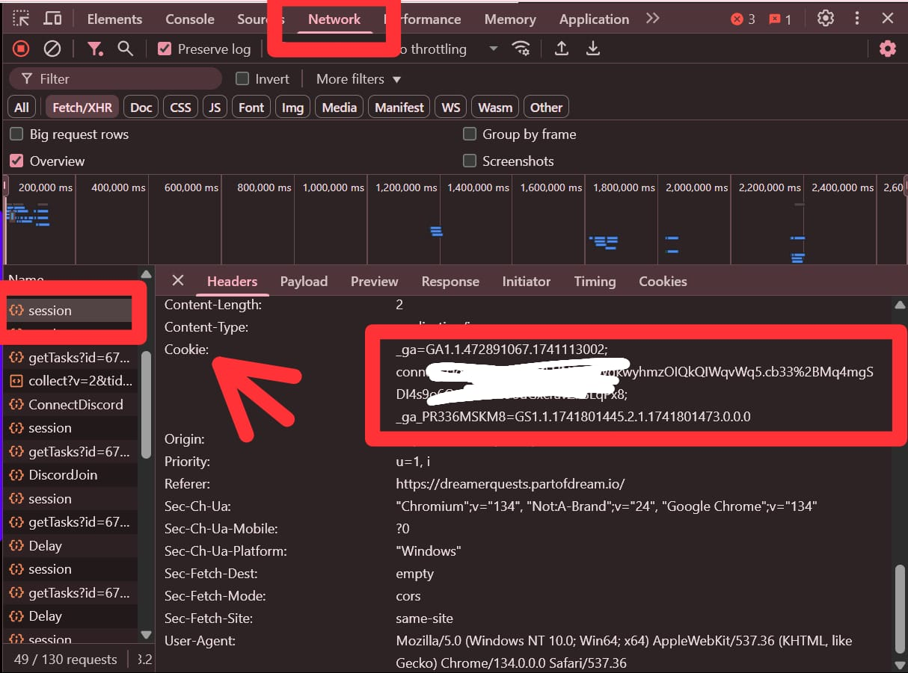

# Part Of Dream BOT
Part Of Dream BOT

- Register Here : [Part Of Dream](https://dreamerquests.partofdream.io/login?referralCodeForPOD=adde7d39)
- Login With X
- Don't Forget to Connect Wallet & Social Media Account
- Enter Code : adde7d39

## Features

  - Auto Get Account Information
  - Auto Run With [Monosans](https://raw.githubusercontent.com/monosans/proxy-list/main/proxies/all.txt) Proxy - Choose 1
  - Auto Run With Private Proxy - Choose 2
  - Auto Run Without Proxy - Choose 3
  - Auto Claim Daily Check-In
  - Auto Perform Spin
  - Multi Accounts

## Requiremnets

- Make sure you have Python3.9 or higher installed and pip.

## Instalation

1. **Clone The Repositories:**
   ```bash
   git clone https://github.com/vonssy/DreamerQuests-BOT.git
   ```
   ```bash
   cd DreamerQuests-BOT
   ```

2. **Install Requirements:**
   ```bash
   pip install -r requirements.txt #or pip3 install -r requirements.txt
   ```

## Configuration

### Screenshots

<div style="text-align: center;">
  <h4><strong>Cookie String Data</strong></h4>
  
</div>

- **cookies.txt:** You will find the file `cookies.txt` inside the project directory. Make sure `cookies.txt` contains data that matches the format expected by the script. Here are examples of file formats:
  ```bash
  your_cookie_data_1
  your_cookie_data_2
  ```

- **proxy.txt:** You will find the file `proxy.txt` inside the project directory. Make sure `proxy.txt` contains data that matches the format expected by the script. Here are examples of file formats:
  ```bash
  ip:port # Default Protcol HTTP.
  protocol://ip:port
  protocol://user:pass@ip:port
  ```

## Run

```bash
python bot.py #or python3 bot.py
```
